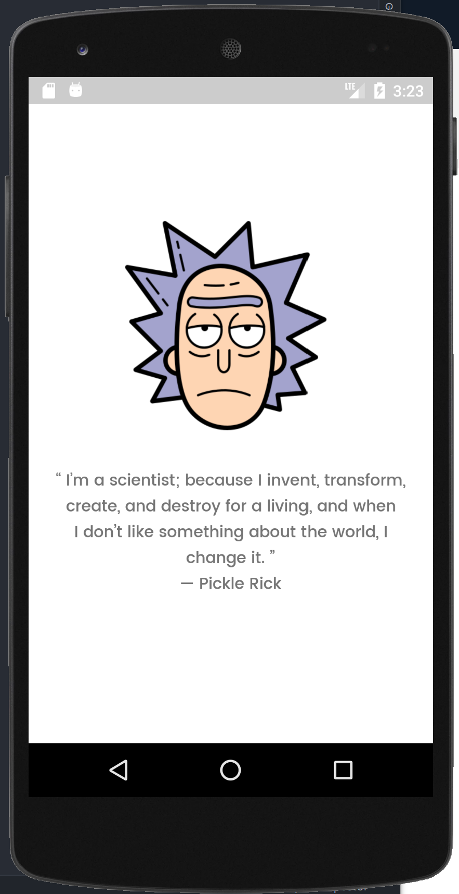
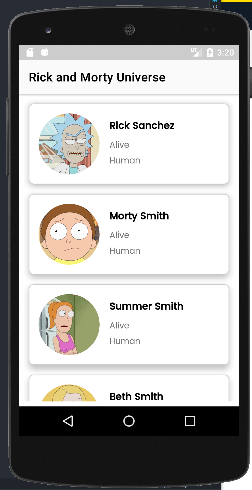
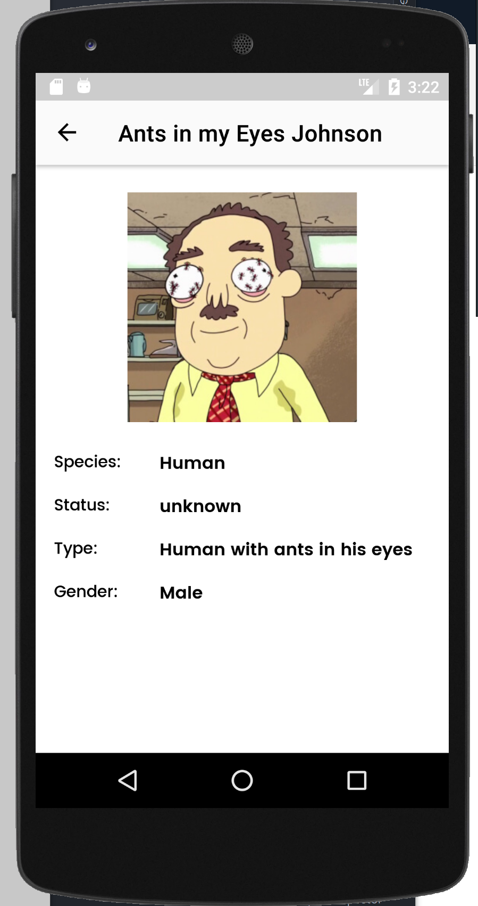

# The Rick and Morty Universe

A simple app that fetches data from [the Rick and Morty API](https://rickandmortyapi.com/) and displays data in a list.
it also shows some of the best practices in Android Development. Including:
* ViewModel
* LiveData
* Hilt (for dependency injection)
* Kotlin Coroutines
* Retrofit
* Room
* Navigation

[Download APK](https://github.com/chydee/The-Rick-and-Morty/releases/download/v1.0/app-debug.apk)

Minimum Api Level : 21 compileSdkVersion : 30

Build System : [Gradle](https://gradle.org/)

 ## Table of Contents

-   [Motivation](#motivation)
-   ["Production level" implementations](#implementations)
-   [Screenshots](#screenshots)
-   [Installation](#installation)
-   [Testing](#testing)

## Motivation

“I know that new situations can be intimidating. You’re lookin’ around and it’s all scary and different, but y’know, meeting them head-on, c
harging into ‘em like a bull — that’s how we grow as people.” — Rick

With this in mind, I'm looking for a role with challenging problems to work on and also take me beyond my limits and I look forward to building a product that
will have more users where I can get valuable feedback from the users and be able to take action based on the feedback. One of the important things at
this stage of my career is growth, so I'm interested in a company or startup with a good growth trajectory. Hence why I applied for the
Junior Android Developer Role at PRINTFUL.

## "Production level" implementations
- Linting style with [Ktlint](https://github.com/JLLeitschuh/ktlint-gradle)
- Pre push checks the code with `perform code analysis`, `reformat code` and `optimize imports`
- Dependency Injection with [Dagger-Hilt](https://developer.android.com/training/dependency-injection/hilt-android)
- Testing with [Espresso](https://developer.android.com/training/testing/espresso) and [JUnit4](https://developer.android.com/training/testing/junit-rules)

## Screenshots

 ## Installation
    Follow these steps if you want to get a local copy of the project.

    Prerequisites
    Android Studio IDE 3.0+
    Android SDK v28
    Android Build Tools v28.0.3
    Gradle 4.10.1
    1. Clone or fork the repository (Master Branch) by running the command below
    on your git terminal

    git clone https://github.com/chydee/The-Rick-and-Morty.git
    2. Import the project in AndroidStudio
    In Android Studio, go to File -> New -> Import project
    Follow the dialog for set up instructions

    To run this application, please use an Android device or emulator (OS 5.0 or newer).

## Testing
###  Device Tests:
  - <b>App Navigation Test</b> - Navigation between screens is tested using Espresso UI framework and ActivityScenario for lifecycle state. `Hilt` provides test version of Repository and automatically generates a new set of components for each test. This is done with use of a `CustomTestRunner` that uses an Application configured with Hilt. In order to make Espresso aware of network operations `UriIdlingResource` is registered for UI test.
  - <b>Database Testing</b> - The project creates an in memory database for each database test but still runs them on the device.
  - <b>Activity In Isolation</b> - Tests the activity's component on the device.
  - <b>Fragment In Isolation</b> - Tests the fragment's component on the device.
### Local Unit Tests:
  - <b>Webservice Tests</b> - The project uses MockWebServer project to test REST api interactions.
  - <b>ViewModel Tests</b> - ViewModels are tested using local unit tests with mock Repository implementations.
  - <b>Repository Tests</b> - Repository is tested using local unit tests with mock versions of Service and Database.